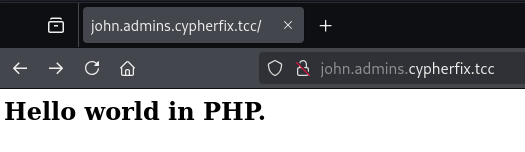
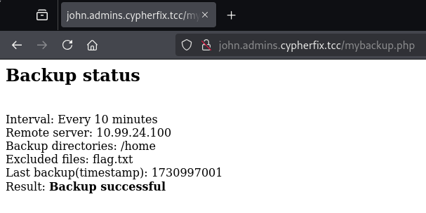
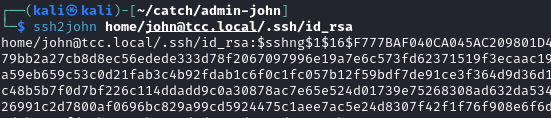

# Admin John

## Description


## Solution

Initial nmap reconnaissance shows that John's workstation has three open ports - 22 for SSH, 80 for a webserver and port 23000 whose purpose is unknown at this point.


Querying the webserver reveals that it probably uses PHP.



Using this information and leveraging gobuster along with the `dirb/big.txt` wordlist and the `php` extension finds two interesting files - `environment.php` and `mybackup.php`.


The `environment.php` page shows the server's `uname`, disk usage and running processes. From the process list, it is apparent that the open port 23000 seen previously is an SSH-tunnelled SOCKS proxy. This information will come in handy later.


The page `mybackup.php` reveals that there is a backup of the `/home` directory, excluding the `flag.txt` file, running every 10 minutes. The backup is stored on a remote server with IP `10.99.24.100`.



Refreshing the page with the process list at the right time when the backup process runs leaks SMB credentials to the backup server, as shown below.


The leaked credentials are `backuper`:`Bprn5ibLF4KNS4GR5dt4`. Using these credentials along with the `smbclient` command makes it trivial to download the saved backup file.


Unfortunately, the `flag.txt` file is excluded from the backup as noted on the `mybackup.php` page. Out of the files saved in the backup, the most interesting one is the user's SSH private key stored at `home/john@tcc.local/.ssh/id_rsa`.

```
$ tar -xvf backup-home.tgz 
home/
home/john@tcc.local/
home/john@tcc.local/.mozilla/
home/john@tcc.local/.mozilla/firefox/
...
home/john@tcc.local/.ssh/
home/john@tcc.local/.ssh/authorized_keys
home/john@tcc.local/.ssh/id_rsa                   <<<<<<<<<<<<<<<
home/john@tcc.local/.ssh/known_hosts
home/john@tcc.local/.ssh/id_rsa.pub
home/john@tcc.local/.selected_editor
```

Examining the private key with `ssh-keygen` unfortunately shows that the key is protected with a password.


To try and crack the private key's password, it is first necessary to extract the crackable hash using the `ssh2john` tool.



In this case, the [hashcat](https://hashcat.net/hashcat/) tool was used, which meant the hash file needed to be altered slightly, i.e. removing the file name from the beginning of the file, as shown below.


Now, to try and crack the hash using hashcat along with a ruleset called [OneRuleToRuleThemStill](https://github.com/stealthsploit/OneRuleToRuleThemStill) and the `rockyou` wordlist, the following command was used.

```
$ .\hashcat.exe -r ..\wordlists\OneRuleToRuleThemStill.rule .\id_rsa.hash ..\wordlists\rockyou.txt
```

After a few seconds, the password is cracked - `Enterprise2215`.


Examining the `.ssh` folder closer, the `authorized_keys` file contains a single line which specifies that once the private key is used to log in, the command `cat /home/john@tcc.local/flag.txt` is executed, hopefully printing the flag. At the same time, the key is restricted to be only used to log in from the IP address `10.99.24.100`.


The address above is the address of the other server to which the server backup was uploaded as well as where the SSH tunnel with the exposed SOCKS proxy on port 23000 is pointed at. This means that it is possible to exploit the SOCKS SSH tunnel to access John's workstation from the specified IP address using proxychains.


Using the proxychains configuration shown above, it is possible to log in to John's user account and get the flag. Note that the username is `john@tcc.local`, not just `john`.

## Flag

`FLAG{sIej-5d9a-aIbh-v4qH}`