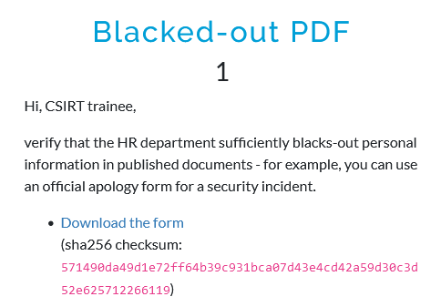
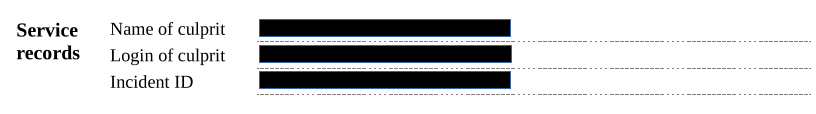
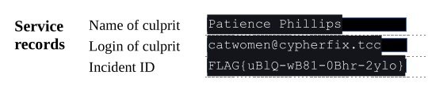

# Blacked-out PDF
## Description

## Solution

The provided PDF form has some fields blackened out, as shown below.

Although the secret text is covered by black rectangles, it is still present in the document and recognized by PDF readers, meaning it can be revealed by simply selecting the text, as shown below.

The incident ID field contains the flag.

## Flag

`FLAG{uBlQ-wB81-0Bhr-2ylo}`