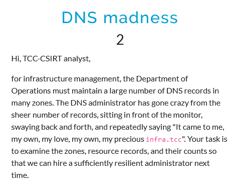

# DNS madness

## Description



## Solution

Starting with a basic ANY query to recon the DNS records.

```
$ dig any infra.tcc

; <<>> DiG 9.20.2-1-Debian <<>> any infra.tcc
;; global options: +cmd
;; Got answer:
;; ->>HEADER<<- opcode: QUERY, status: NOERROR, id: 19605
;; flags: qr rd ra; QUERY: 1, ANSWER: 3, AUTHORITY: 0, ADDITIONAL: 5

;; OPT PSEUDOSECTION:
; EDNS: version: 0, flags:; udp: 1232
; COOKIE: aea6e20599f808b101000000672531e25e045216f8a66ec8 (good)
;; QUESTION SECTION:
;infra.tcc.                     IN      ANY

;; ANSWER SECTION:
infra.tcc.              68392   IN      NS      jameson.infra.tcc.
infra.tcc.              68392   IN      NS      jamison.infra.tcc.
infra.tcc.              68392   IN      SOA     jessiejames.infra.tcc. hostmaster.infra.tcc. 2024100701 604800 86400 2419200 86400

;; ADDITIONAL SECTION:
jameson.infra.tcc.      33501   IN      A       10.99.24.29
jamison.infra.tcc.      33426   IN      A       10.99.24.28
jameson.infra.tcc.      33501   IN      AAAA    2001:db8:7cc::24:29
jamison.infra.tcc.      33426   IN      AAAA    2001:db8:7cc::24:28

;; Query time: 4 msec
;; SERVER: 10.99.0.1#53(10.99.0.1) (TCP)
;; WHEN: Fri Nov 01 15:54:10 EDT 2024
;; MSG SIZE  rcvd: 257
```

The SOA (Start Of Authority) record contains administrative information about the zone, such as the zone's primary nameserver, administrator email address, etc. This information can be used to perform a zone transfer if the primary server allows, as shown below.

```
$ dig axfr @jessiejames.infra.tcc infra.tcc

; <<>> DiG 9.20.2-1-Debian <<>> axfr @jessiejames.infra.tcc infra.tcc
; (1 server found)
;; global options: +cmd
infra.tcc.              86400   IN      SOA     jessiejames.infra.tcc. hostmaster.infra.tcc. 2024100701 604800 86400 2419200 86400
infra.tcc.              86400   IN      NS      jameson.infra.tcc.
infra.tcc.              86400   IN      NS      jamison.infra.tcc.
jameson.infra.tcc.      86400   IN      AAAA    2001:db8:7cc::24:29
jameson.infra.tcc.      86400   IN      A       10.99.24.29
jamison.infra.tcc.      86400   IN      AAAA    2001:db8:7cc::24:28
jamison.infra.tcc.      86400   IN      A       10.99.24.28
jessiejames.infra.tcc.  86400   IN      AAAA    2001:db8:7cc:0:6361:74:24:27
infra.tcc.              86400   IN      SOA     jessiejames.infra.tcc. hostmaster.infra.tcc. 2024100701 604800 86400 2419200 86400
;; Query time: 8 msec
;; SERVER: 2001:db8:7cc:0:6361:74:24:27#53(jessiejames.infra.tcc) (TCP)
;; WHEN: Fri Nov 01 16:03:24 EDT 2024
;; XFR size: 9 records (messages 1, bytes 321)
```

This zone transfer does not give any additional information about the zone than the initial ANY query. On the other hand, zone transfer on the catalog zone gives a lot more info. This special zone, defined in RFC 9432, lists other zones to be served by the given nameserver. Truncated result of this query is shown below.

```
$ dig @jessiejames.infra.tcc axfr catalog.infra.tcc 

; <<>> DiG 9.20.2-1-Debian <<>> @jessiejames.infra.tcc axfr catalog.infra.tcc
; (1 server found)
;; global options: +cmd
catalog.infra.tcc.      86400   IN      SOA     . . 2024100802 604800 86400 2419200 86400
catalog.infra.tcc.      86400   IN      NS      invalid.
version.catalog.infra.tcc. 86400 IN     TXT     "2"
aldoriainfratcc.zones.catalog.infra.tcc. 3600 IN PTR aldoria.infra.tcc.
aldorninfratcc.zones.catalog.infra.tcc. 3600 IN PTR aldorn.infra.tcc.
...
zeloriainfratcc.zones.catalog.infra.tcc. 3600 IN PTR zeloria.infra.tcc.
zephyriainfratcc.zones.catalog.infra.tcc. 3600 IN PTR zephyria.infra.tcc.
zylariainfratcc.zones.catalog.infra.tcc. 3600 IN PTR zylaria.infra.tcc.
catalog.infra.tcc.      86400   IN      SOA     . . 2024100802 604800 86400 2419200 86400
;; Query time: 8 msec
;; SERVER: 2001:db8:7cc:0:6361:74:24:27#53(jessiejames.infra.tcc) (TCP)
;; WHEN: Fri Nov 01 15:48:19 EDT 2024
;; XFR size: 105 records (messages 1, bytes 3948)
```

Performing zone transfers for all the listed zones can be done with the following command.

```
$ dig axfr @jessiejames.infra.tcc catalog.infra.tcc | head -n -6 | tail -n +8 | awk '{print $5}' | xargs -n 1 dig axfr @jessiejames.infra.tcc > out.txt
```

Investigating the resulting file `out.txt` reveals that each of the zones consists of bunch of AAAA records for (probably) randomly generated domain names. An example of that is shown below for zone `aldoria.infra.tcc`.

```
$ dig axfr @jessiejames.infra.tcc aldoria.infra.tcc | head -n 50

; <<>> DiG 9.20.2-1-Debian <<>> axfr @jessiejames.infra.tcc aldoria.infra.tcc
; (1 server found)
;; global options: +cmd
aldoria.infra.tcc.      86400   IN      SOA     jessiejames.infra.tcc. hostmaster.infra.tcc. 2024100701 604800 86400 2419200 86400
aldoria.infra.tcc.      86400   IN      NS      jameson.infra.tcc.
aldoria.infra.tcc.      86400   IN      NS      jamison.infra.tcc.
0028baff3292d5dc7c292674da4de92b.aldoria.infra.tcc. 86400 IN AAAA 2001:db8:7cd::24:69bc
007ba081563843d92dd4acd5ea4621c3.aldoria.infra.tcc. 86400 IN AAAA 2001:db8:7cd::24:de4
007f0576102d8a97c661170ab55622ff.aldoria.infra.tcc. 86400 IN AAAA 2001:db8:7cd::24:be09
00bbe281197083450508064ced656220.aldoria.infra.tcc. 86400 IN AAAA 2001:db8:7cd::24:3bfc
01055a95e8c37ee4f3cf27e5693b8488.aldoria.infra.tcc. 86400 IN AAAA 2001:db8:7cd::24:cf67
...
```

Digging in the output further reveals that only a single zone named `banneron` contains a TXT record with base64 encoded data.

```
$ dig axfr @jessiejames.infra.tcc banneron.infra.tcc     

; <<>> DiG 9.20.2-1-Debian <<>> axfr @jessiejames.infra.tcc banneron.infra.tcc
; (1 server found)
;; global options: +cmd
banneron.infra.tcc.     86400   IN      SOA     jessiejames.infra.tcc. hostmaster.infra.tcc. 2024100701 604800 86400 2419200 86400
banneron.infra.tcc.     86400   IN      NS      jameson.infra.tcc.
banneron.infra.tcc.     86400   IN      NS      jamison.infra.tcc.
40ae12928dbf450106d8097a7ec875ea.banneron.infra.tcc. 86400 IN AAAA 2001:db8:7cd::24:6577
40ae12928dbf450106d8097a7ec875ea.banneron.infra.tcc. 86400 IN TXT "RkxBR3tBdlhPLWlNazctM2JvSC1pWURwfQ=="
banneron.infra.tcc.     86400   IN      SOA     jessiejames.infra.tcc. hostmaster.infra.tcc. 2024100701 604800 86400 2419200 86400
;; Query time: 4 msec
;; SERVER: 2001:db8:7cc:0:6361:74:24:27#53(jessiejames.infra.tcc) (TCP)
;; WHEN: Fri Nov 01 16:24:23 EDT 2024
;; XFR size: 6 records (messages 1, bytes 324)
```

Decoding the string `RkxBR3tBdlhPLWlNazctM2JvSC1pWURwfQ==` gives the flag.

## Flag

`FLAG{AvXO-iMk7-3boH-iYDp}`