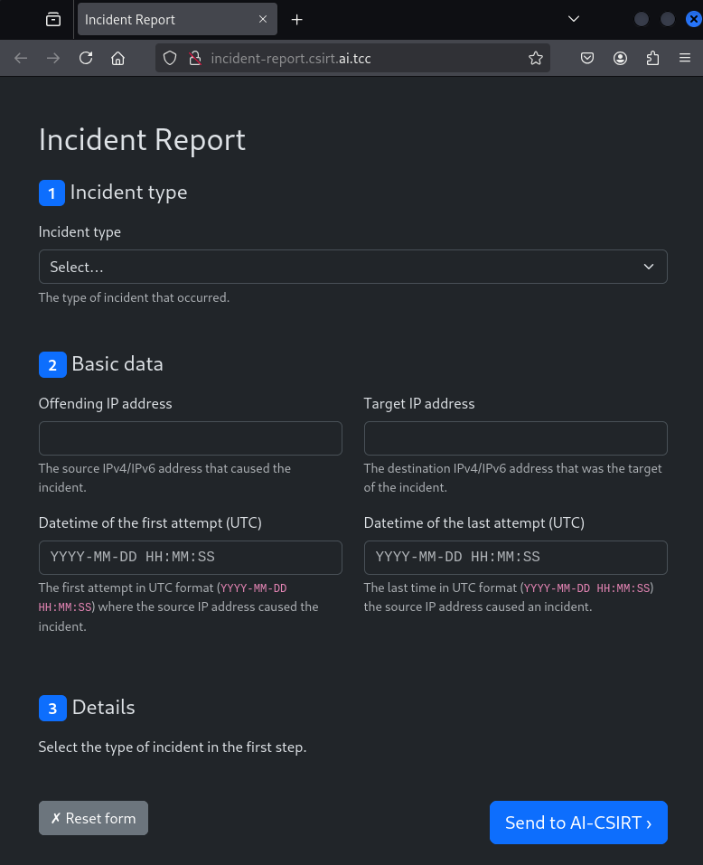

# Incident reporting
## Description


## Solution

This challenge's description provides a pcap file which contains traffic in which several incidents are supposedly captured. The incident reporting interface looks as follows.



The incident's type, offending and target IP addresses and time window in which the incident occurred have to be identified. The incident details depend on the type of incident. For example, for a brute force attack, the details include the number of attack attempts and if the attack was successful.

The first incident in the file is a brute-force attack on a login form.


Filling out the form as follows identifies the attack successfully.


When submitted, the evaluation AI reveals an "incident ID" which is a base64-encoded part of the flag.


The second incident is a DDoS.


The third one is a port scan.


And the last incident is a web service enumeration.


Decoding all the base64-encoded pieces of data reveals the flag divided into four parts.

```
1/4: FLAG{lE8
2/4: s-Ukox
3/4: -a0Qf-
4/4: d5kM}
```

## Flag

`FLAG{lE8s-Ukox-a0Qf-d5kM}`