# Johny's notes
## Description

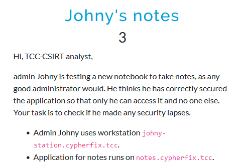

## Solution

On the initial scan, the ports open are 22 and 80 for SSH and HTTP on Johny's station and ports 80, 8080 and 8081 on the host where the notes application is hosted. 

 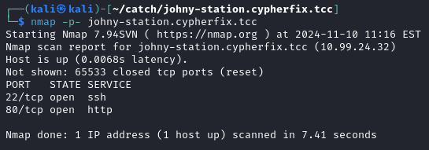
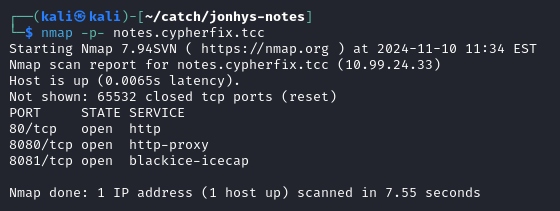

The notes server main page contains a bit of JS code which redirects the user to the same host, but different port - 8080. Unfortunately, neither port 8080 or 8081 respond when queried, as shown in the screenshot below. By the challenge description an assumption can be made that the application can only be accessed from the IP of Johny's workstation.

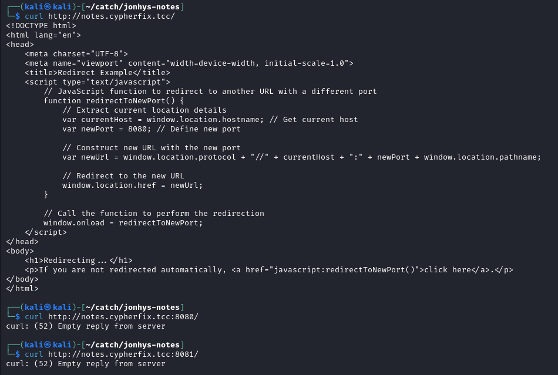

Looking closer at the workstation's web server on port 80 with gobuster reveals that there is a publicly accessible directory `~johny`.

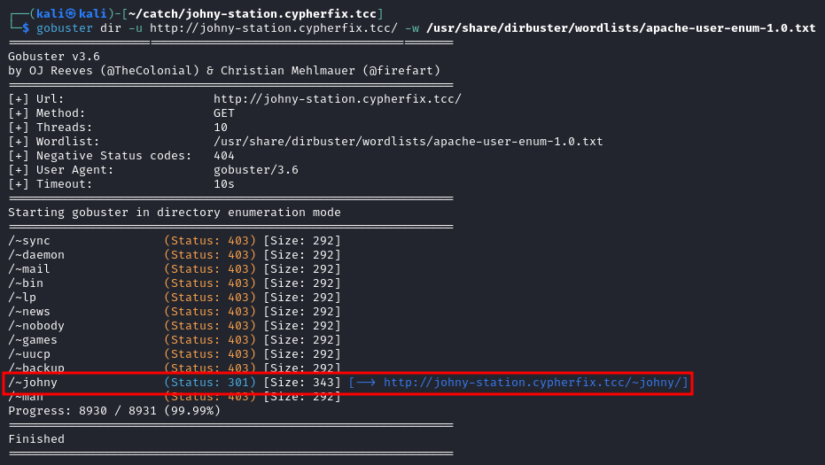

Johny's directory on the webserver contains a single subdirectory called  `flatnotes`, which is the notes app that is running on the notes host. One online search suffices to find the app's [GitHub repository](https://github.com/dullage/flatnotes) and that the files in the `flatnotes` directory closely resemble its structure. 

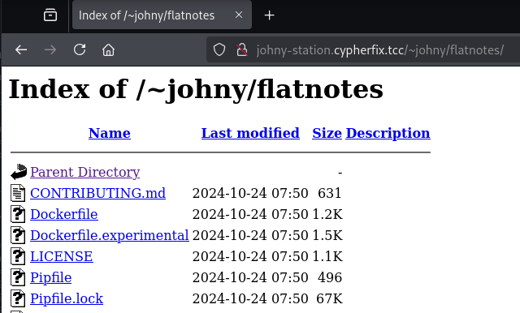

Considering this directory is probably a git repository, there might as well be `.git` directory with the repository's log, etc. This proves to be the case, as shown below.

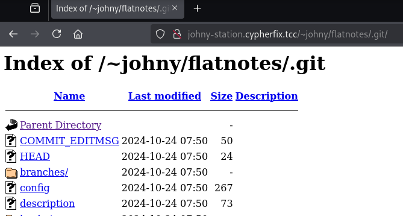

To recursively download the `.git` directory, `wget` can be used.

```
$ wget -r http://johny-station.cypherfix.tcc/~johny/flatnotes/.git/
```

Putting `.git` in an empty directory, allows to use the `git` commands as in a regular repository. Looking at the log with the `-p` switch to show the code changes quickly reveals Johny's password, `gojohnygo`.

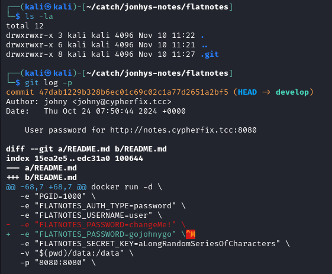

Since Johny is reusing passwords, using the password above along with username `johny` to log in to the SSH on Johny's workstation works. Unfortunately, it does not allow shell access and thus prints `This account is currently not available`.

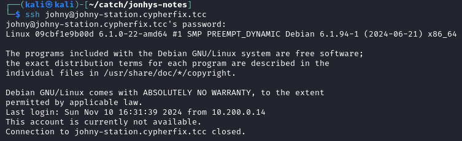

What the found SSH credentials allow though, is tunnelling traffic through Johny's machine. 

```
$ ssh johny@johny-station.cypherfix.tcc -L 1234:10.99.24.33:80 -N
```

This allows to access the notes application.

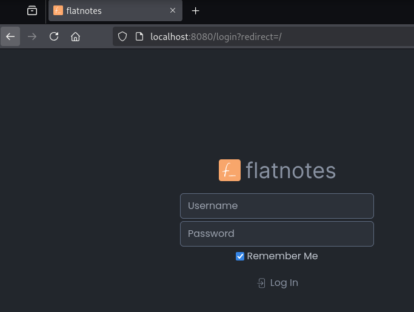

At this point, credentials for the notes app are also known from the commit mentioned previously, i.e. `user`:`gojohnygo`.
 
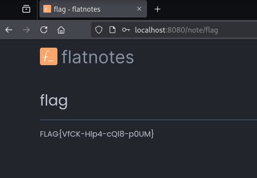

In the app, there's a note with the flag.

## Flag

`FLAG{VfCK-Hlp4-cQl8-p0UM}`.
