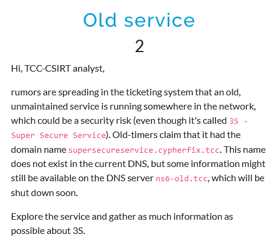

# Old service
## Description



## Solution

Querying the nameserver reveals a lot of information, including several SVCB records.

```
$ dig @ns6-old.tcc any supersecureservice.cypherfix.tcc                           

; <<>> DiG 9.20.2-1-Debian <<>> @ns6-old.tcc any supersecureservice.cypherfix.tcc
; (2 servers found)
;; global options: +cmd
;; Got answer:
;; ->>HEADER<<- opcode: QUERY, status: NOERROR, id: 9239
;; flags: qr aa rd; QUERY: 1, ANSWER: 7, AUTHORITY: 0, ADDITIONAL: 1
;; WARNING: recursion requested but not available

;; OPT PSEUDOSECTION:
; EDNS: version: 0, flags:; udp: 1232
; COOKIE: 085527a14ff8672a0100000067237c724a75fb8a342145ef (good)
;; QUESTION SECTION:
;supersecureservice.cypherfix.tcc. IN  ANY

;; ANSWER SECTION:
supersecureservice.cypherfix.tcc. 86400 IN TXT  "Super secure service in testing mode, any records are hipsters friendly!"
supersecureservice.cypherfix.tcc. 86400 IN HINFO "TCC 686" "TCC-OS 20.20"
supersecureservice.cypherfix.tcc. 86400 IN SVCB 2 web3s-7468656361746368323032342.cypherfix.tcc. alpn="h2,h3,mandatory=alpn" port=8020
supersecureservice.cypherfix.tcc. 86400 IN SVCB 4 web3s-7468656361746368323032343.cypherfix.tcc. alpn="h2,h3,mandatory=alpn" port=8020
supersecureservice.cypherfix.tcc. 86400 IN SVCB 1 web3s-746865636174636832303234.cypherfix.tcc. alpn="h2,h3,mandatory=alpn" port=8020
supersecureservice.cypherfix.tcc. 86400 IN A    10.99.24.21
supersecureservice.cypherfix.tcc. 86400 IN AAAA 2001:db8:7cc::24:21

;; Query time: 4 msec
;; SERVER: 2001:db8:7cc::24:20#53(ns6-old.tcc) (TCP)
;; WHEN: Thu Oct 31 08:47:47 EDT 2024
;; MSG SIZE  rcvd: 526
```

The information stored in the SVCB record with priority 1, reveals the following about the "Super secret service":
- IP address - `10.99.24.21`
- port - 8020
- hostname - `web3s-746865636174636832303234.cypherfix.tcc`

Combining these pieces of information into an HTTP request yields the service's main page.

```
$ curl -H "Host: web3s-746865636174636832303234.cypherfix.tcc" http://10.99.24.21:8020/
...
    <small>
    You have right to choose password easy to remember and hard to guess.<br>
    Your security is important for us, do not hesitate to ask for more security.<br>
    Log in gracefully and purring like a dozen of cats, so no one can you see you.<br>
    If you fail to login, use your personal identifier FLAG{yNx6-tH9y-hKtB-20k6} and show it to user support.<br>
...
```

The text on the page shown above contains the flag.

## Flag

`FLAG{yNx6-tH9y-hKtB-20k6}`