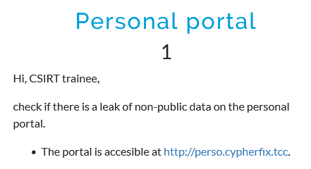
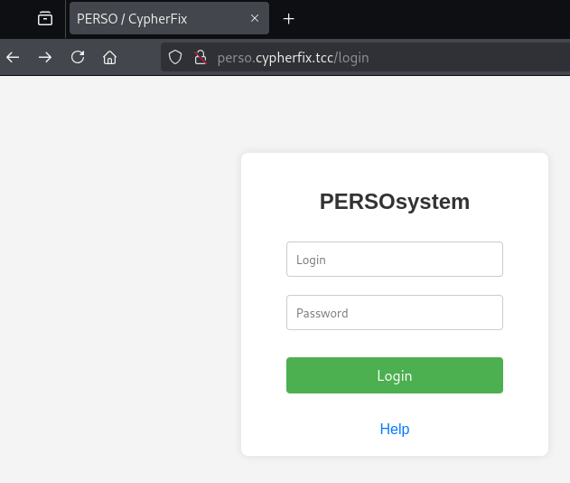
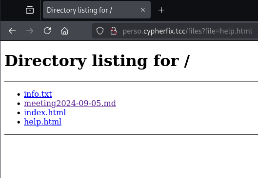
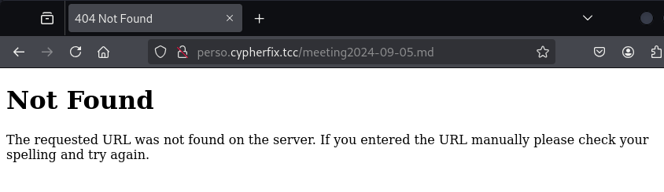
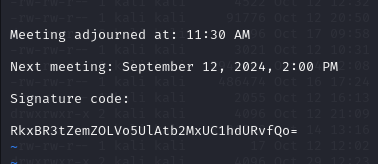

# Personal portal
## Description

## Solution

The website at the given URL contains a single login form to which the credentials are unknown and a link to a "Help" page.

Following the "Help" link yields a page with URL which hints that the page is including files from a directory based on the `file` GET parameter. This means that the directory listing shown below is not really generated by the web server, but a directory listing saved in an HTML file called `help.html`.

Nonetheless, the information from the listing can be leveraged to solve the challenge. The most interesting file seems to be the one called `meeting2024-09-05.md`.

Unfortunately, simply clicking the link gives a 404 error.

Changing the `file` GET parameter to the name of the file allows to download the file.

`http://perso.cypherfix.tcc/files?file=meeting2024-09-05.md`

The file contains a bunch of text and a "Signature code" at the end, which is a base64-encoded text.

Decoding the string yields the flag.

## Flag

`FLAG{YzfN-Z9RP-oc1P-auDo}`