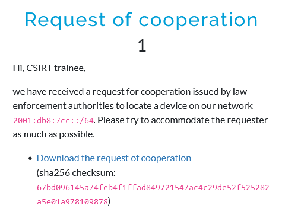
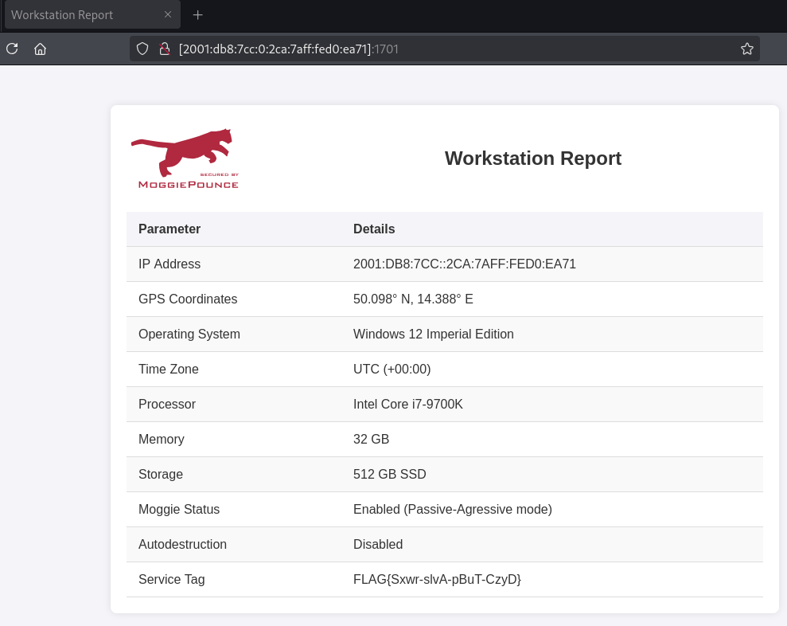

# Request of cooperation
## Description

## Solution

This challenge provides a PDF file with information about a certain device on the IPv6 network. The goal is to find this device's IPv6 address and examine it.

The most important pieces of information in the document to achieve the goal are:
- Network range: `2001:db8:7cc::/64`
- Device MAC address: `00ca.7ad0.ea71`
- HTTP server port: `1701/tcp`

These bit of information can be combined into an Extended Unique Identifier (EUI-64, [Article on Cisco Community](https://community.cisco.com/t5/networking-knowledge-base/understanding-ipv6-eui-64-bit-address/ta-p/3116953)) by following these steps:
1. Split the MAC address into two halves.
   = `00ca7a` and `d0ea71`
2. Insert bytes `FF`, `FE` in between.
   = `00ca7afffed0ea71`
3. Set the 2nd bit of the first byte to 1, which marks that the address is globally unique.
   = `02ca7afffed0ea71`
4. Prepend the network range to the result of the previous step and format the output as an IPv6 address.

The resulting IPv6 address is `2001:db8:7cc::02ca:7aff:fed0:ea71`. Combining it with the provided HTTP port gives a full URL: `http://[2001:db8:7cc:0:2ca:7aff:fed0:ea71]:1701/` which when visited in a web browser, yields the website below.

The "Workstation Report" website contains the flag.

## Flag

`FLAG{Sxwr-slvA-pBuT-CzyD}`