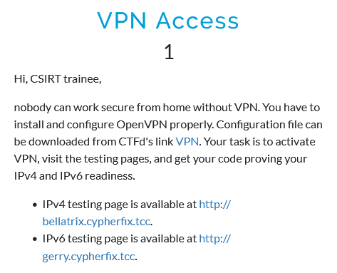

# VPN Access
## Description



## Solution

This challenge's purpose is to test the VPN connection to the game's network. First step is to activate the OpenVPN connection.

```
# openvpn ctfd_ovpn.ovpn
```

Then, visiting each of given URLs yields half of the flag.

```
$ curl http://bellatrix.cypherfix.tcc/ 
...
        <p>Meow there, my half of the verification code is <tt class="code">FLAG{Hgku-58OA</tt>, purrhaps you send me a yummy tuna can, meow?</p>
...
```

```
$ curl http://gerry.cypherfix.tcc/     
        <p>Purr, my part of the code is <tt class="code">-Hsrn-03Zr}</tt>, could you paw-lease send me a scrumptious chicken treat, meow?</p>
```

## Flag

`FLAG{Hgku-58OA-Hsrn-03Zr}`