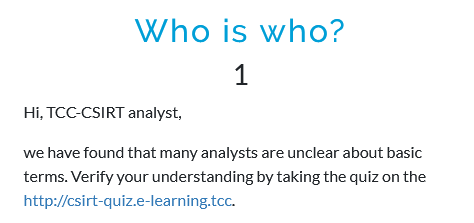
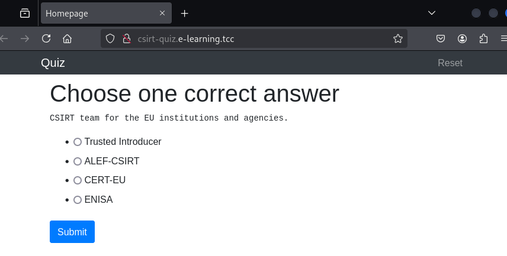

# Who is who?
## Description



## Solution

This challenge is a quiz about CSIRT teams and related topics.



```
Q: CSIRT team for the EU institutions and agencies.
A: CERT-EU

Q: Czech CSIRT team celebrating 20th anniversary.
A: CESNET-CERTS

Q: The European Union Agency for Cybersecurity.
A: ENISA

Q: International organization of CSIRT teams.
A: FIRST

Q: National CSIRT of the Czech Republic.
A: CSIRT.CZ

Q: Database of European CSIRT teams.
A: Trusted Introducer

Q: Community of European CSIRT teams.
A: TF-CSIRT

Q: Government CERT of the Czech Republic.
A: GovCERT.CZ

Q: The first official CSIRT team in the Czech Republic.
A: CESNET-CERTS

Q: Czech CSIRT team with status certified by Trusted Introducer.
A: ALEF-CSIRT

Q: CSIRT team for the EU institutions and agencies.
A: CERT-EU
```


## Flag

`FLAG{ADT0-cp6f-s071-pXsQ}`